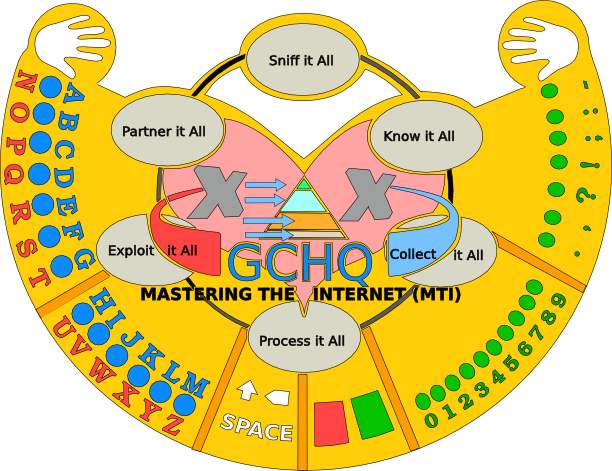

# Sexting-XKeyscore

Communicate with government surveillance programs via your metadata.

This is a component of an art project I collaborated on with [Rosa Nussbaum](http://rosanussbaum.com/sexting-xkeyscore.html). 

Your message is encoded as a sequence of instructions (send an email, make a purchase etc.) which, when followed, produce metadata. It has been shown that this metadata is stored and analysed by the security agencies.

## Running on the command line

You can encode a message into an instruction list for a group of people whose details are in a json file:

    ./sexting.py contacts.json "Put your message here" 11

The last parameter is the hour of the day that the instructions should begin on (0-23), in this case 11:00 in the morning.

A sample `contacts.json` file has been provided.

## Running the web interface

To install dependencies:

    ./build.sh

Start the server running with:

    ./runsextingweb.py

Now access it on [localhost:5000](http://localhost:5000).

## Running the séance web interface

This interface is designed for use with the [Makey Makey](http://makeymakey.com) powered ouija board:

It takes message input from the board then prints a personalised instruction sheet for each person in `contacts.json`.

To install dependencies:

    ./build.sh

Then start the server:

    ./runseance.py

Now access it on [localhost:5000](http://localhost:5000).

### Configuring the board

The ouija board is an enclosing for a Makey Makey.

The board has 7 groups of keys with a maximum of 10 keys in each group.
There is a punctuation group, a digit group, 4 letter groups and a special group (for space, backspace and enter).

There are 18 mappable keys on the Makey Makey. This gives us:
- 7 modifier keys
- 10 regular keys
- 1 shift key

There is a modifier key for each of the 7 groups. Holding down a modifier key makes the other 10 keys on the Makey Makey map to the keys from the corresponding group.
There is also a shift key which causes the letters in the 4 letter groups to become upper case.

This key mapping logic is implemented in JavaScript in the web interface rather than in Processing on the Makey Makey.
This has the advantage that the code can be tested with a regular keyboard and maintained in JS and the disadvantage that a regular keyboard cannot be used to input a message as one would expect with a regular keyboard.

On the Makey Makey itself, each key is simply mapped to a different letter of the alphabet.
You can refer to the Makey Makey key mappings in [web/static/sexting_input.js](web/static/sexting_input.js). 
